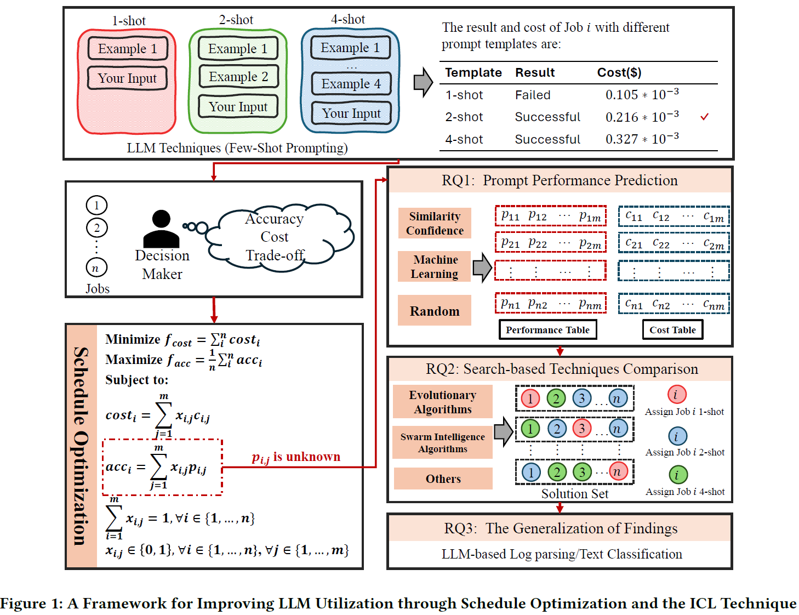
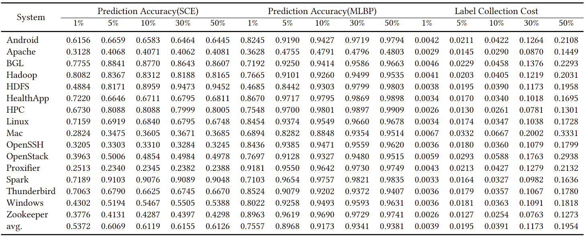
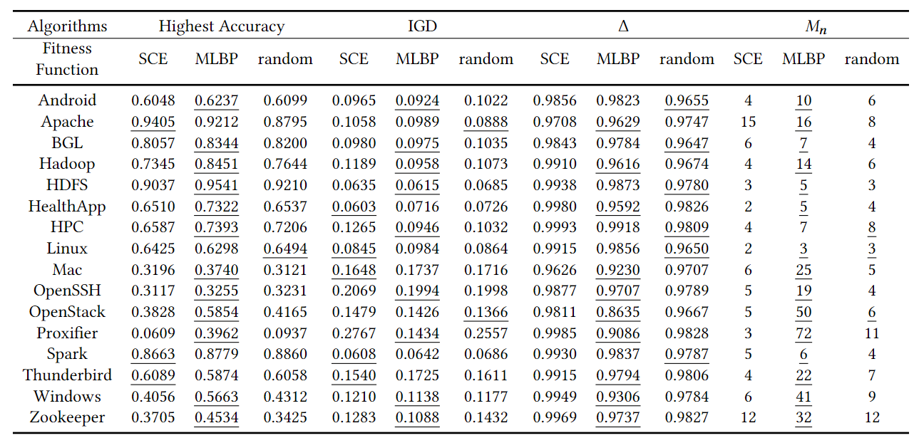
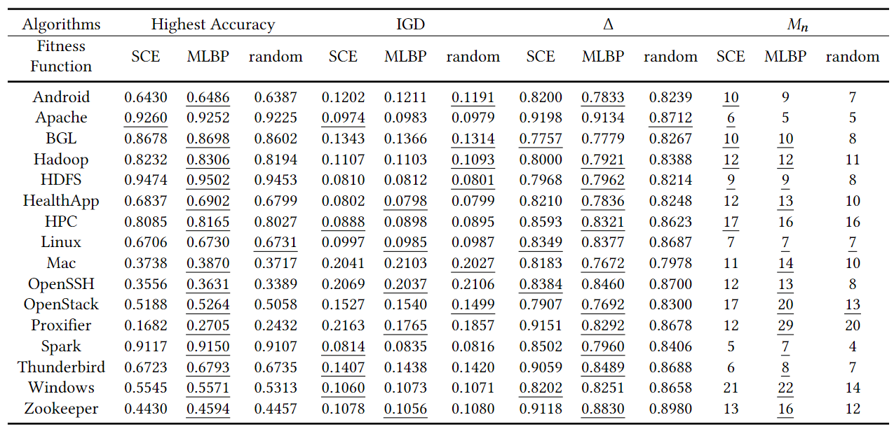
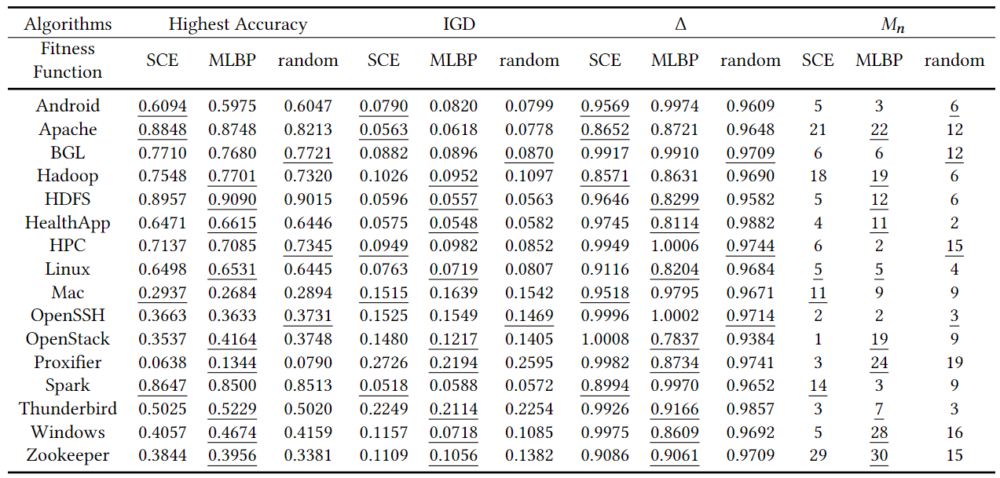
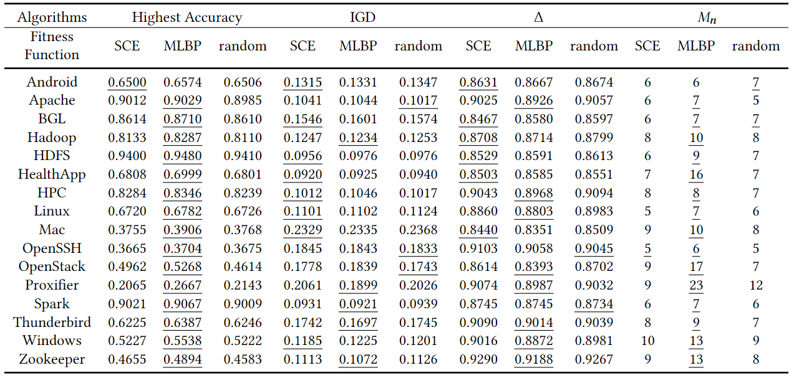
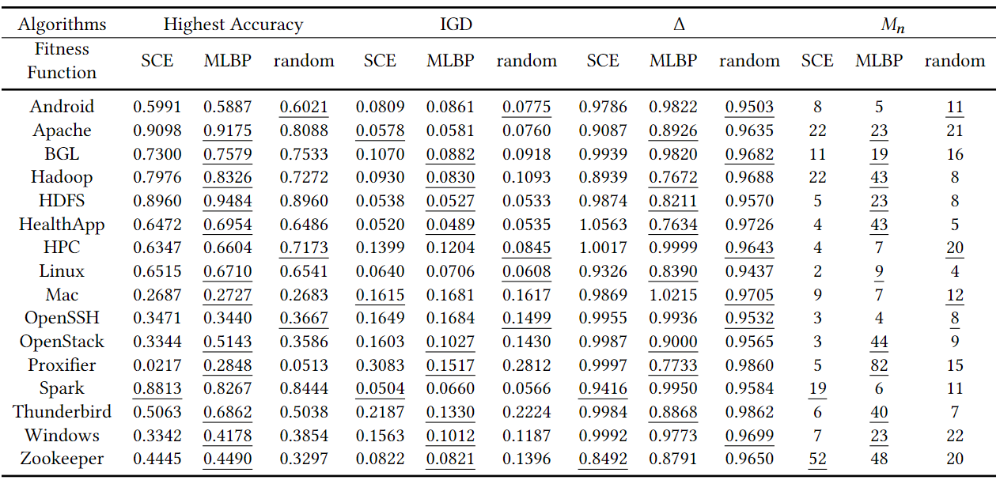
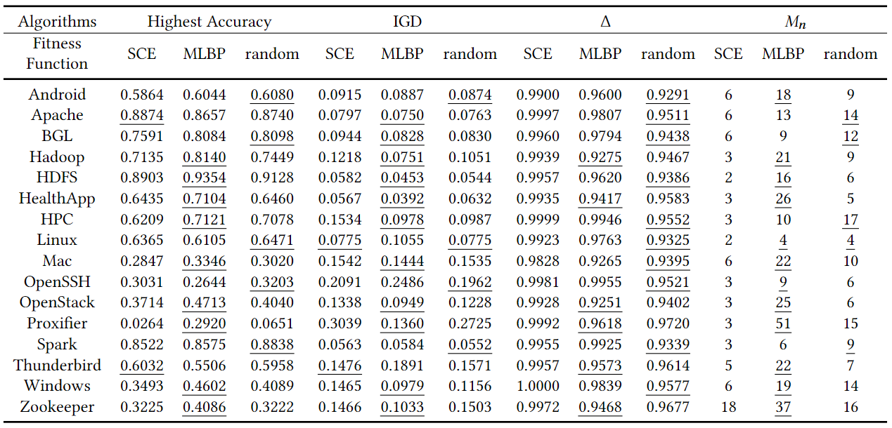
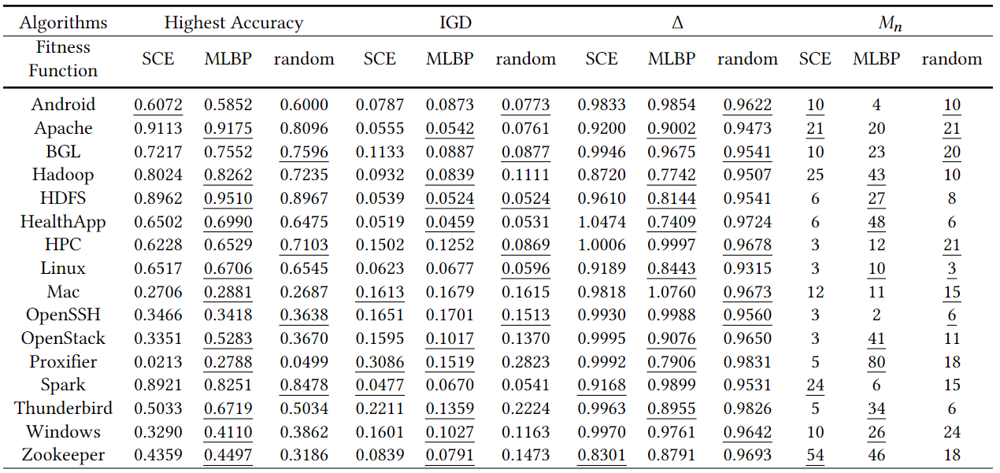

# Study on Large Language Model Performance

This study aims to investigate the potential of combining schedule optimization with ICL to optimize LLM utilization
### 1. Study Design

 

### 2. Research Questions
 - RQ1: What kind of prediction techniques are helpful to evaluate the accuracy objective in the fitness function without actually submitting the queries to the LLM?

 - RQ2: How do various search-based techniques perform in identifying optimal solutions for the prompt template allocation problem?

 - RQ3: How generalizable are our findings across different LLMs and datasets?

### 3. Additional Results

#### 3.1 Training Data Size Impact on Prediction Accuracy and Label Collection Cost

 Impact of Training Data Size on Prediction Accuracy and Label Collection Cost

 - Prediction accuracy generally increases with larger label sizes for both SCE and MLBP across all systems
 - However, the gains in accuracy diminish when the training size reach a certain point (e.g., 30-50% range)
 - Label collection costs increase significantly with label size, roughly doubling from 1% to 5%, 5% to 10%, and so on

Considering the accuracy improvment and label collection cost, we use 30% of the training data for prediction accuracy evaluation in this study.

#### 3.2 Completed Comparisons (for Table 3)

In our study, we present the average performance across all instances based on several metrics: the highest accuracy achieved, the inverted generational distance (IGD), the delta ($\Delta$) metric, and the count of non-dominated solutions ($M_d$) obtained by combining all algorithms with three different prediction methods.

However, it's important to examine the performance on individual instances, as the characteristics of the data may influence the outcomes. Therefore, we provide comparisons for each algorithm using different fitness functions on 16 separate instances. These comparisons include the accuracy, IGD, delta ($\Delta$), and the number of non-dominated solutions ($M_n$) specific to each instance.

 Comparisons of NSGA-II with Different Fitness Function in terms of Accuracy, IGD, $\Delta$, and $M_n$

 Comparisons of SPEA2 with Different Fitness Function in terms of Accuracy, IGD, $\Delta$, and $M_n$

 Comparisons of MOPSO with Different Fitness Function in terms of Accuracy, IGD, $\Delta$, and $M_n$

 Comparisons of MOACO with Different Fitness Function in terms of Accuracy, IGD, $\Delta$, and $M_n$

 Comparisons of MOEA/D with Different Fitness Function in terms of Accuracy, IGD, $\Delta$, and $M_n$

 Comparisons of RNSGA-II with Different Fitness Function in terms of Accuracy, IGD, $\Delta$, and $M_n$

 Comparisons of MOEA/D-GEN with Different Fitness Function in terms of Accuracy, IGD, $\Delta$, and $M_n$

### 4 Implementation
$ python exp.py $

We used the standard version of NSGA-II and R-NSGA-II implemented from Pymoo library,  MOACO, MOPSO, MOEA/D and MOEA/D-GEN from Pygmo library, SPEA2 from jMetalPy library. 
The source code of the baselines is available under `llm_prompts_allocation/baselines` directory.
